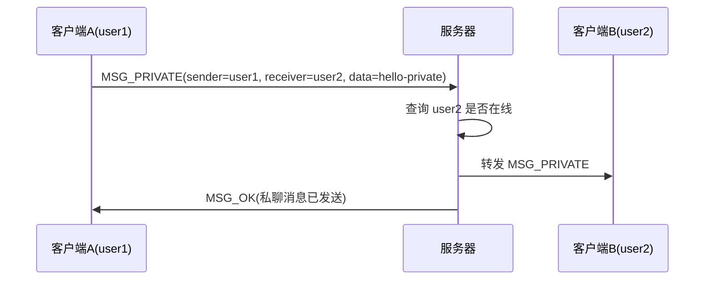
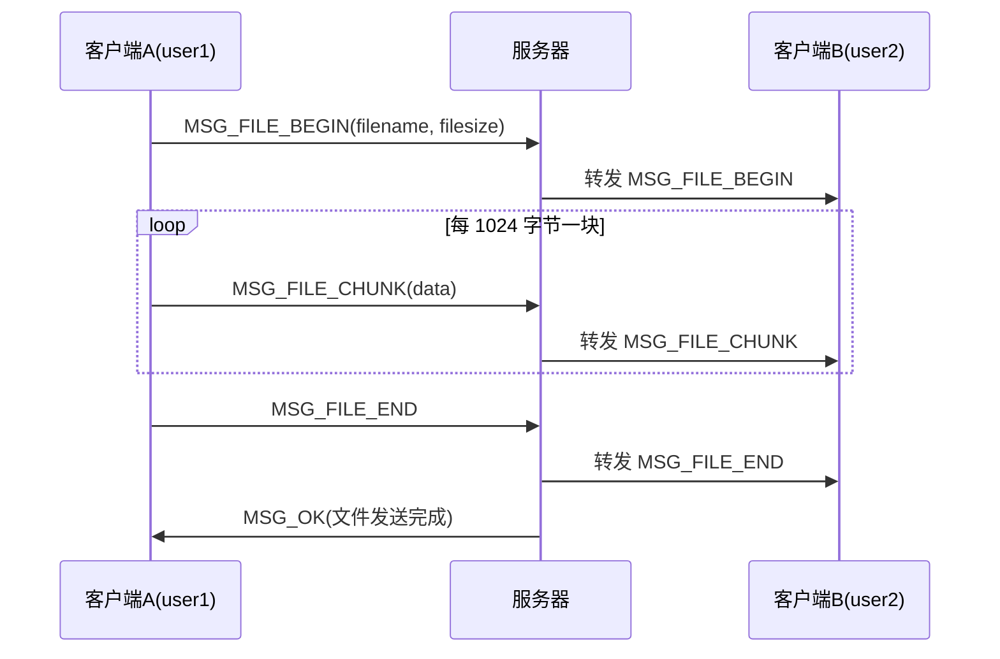
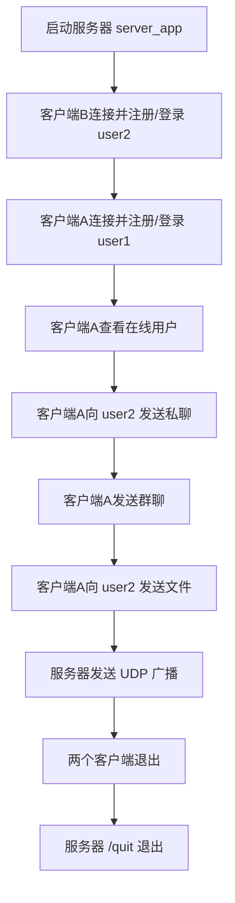

# 两个客户端与服务器实际场景过程文档

本文档说明在 Linux/WSL 环境下，启动 1 个服务器和 2 个客户端后，完成注册、登录、在线列表、私聊、群聊、文件传输、UDP 广播和退出的实际操作过程。

## 1. 场景目标

本场景模拟以下三方：

| 角色 | 程序 | 用户名 | 说明 |
|---|---|---|---|
| 服务器 | `./server_app` | 无 | 负责用户管理、消息转发、文件转发和 UDP 广播 |
| 客户端 A | `./client_app` | `user1` | 发送私聊、群聊和文件 |
| 客户端 B | `./client_app` | `user2` | 接收私聊、群聊、文件和广播 |

完成后应验证：

1. 服务器可以正常启动并监听 TCP/UDP 端口；
2. 两个客户端可以分别注册和登录；
3. 客户端 A 可以查看在线用户列表；
4. 客户端 A 可以向客户端 B 发送私聊消息；
5. 客户端 A 可以发送群聊消息，客户端 B 可以收到；
6. 客户端 A 可以向客户端 B 发送文件；
7. 服务器可以发送 UDP 广播，两个客户端都可以收到；
8. 客户端退出后服务器仍能正常运行。

## 2. 前置准备

在项目根目录执行：

```bash
cd ~/multi_user_chat
make clean && make
```

编译成功后应生成：

```text
server_app
client_app
```

如果编译时提示缺少 OpenSSL 头文件或链接库，需要安装依赖：

```bash
sudo apt install -y libssl-dev
```

为避免旧用户数据影响演示，可以在首次演示前清理运行数据：

```bash
rm -rf data downloads
```

说明：

- `data/users.db` 会在服务器启动和用户注册后自动创建；
- `downloads/` 会在客户端接收文件时自动创建；
- 如果不清理 `data/users.db`，已注册过的用户名再次注册会提示“用户名已存在”。

## 3. 启动服务器

打开终端 1，执行：

```bash
./server_app 9000 9001
```

预期输出：

```text
服务器已启动: TCP 9000, UDP 9001
控制命令: /broadcast 文本, /quit
```

服务器端口说明：

| 端口 | 协议 | 用途 |
|---|---|---|
| `9000` | TCP | 注册、登录、私聊、群聊、文件传输 |
| `9001` | UDP | 系统广播 |

服务器启动后会持续等待客户端连接。后续不要关闭此终端。

## 4. 启动客户端 B 并登录 user2

打开终端 2，执行：

```bash
./client_app 127.0.0.1 9000 9001
```

预期先看到：

```text
已连接服务器 127.0.0.1:9000，UDP广播端口 9001
========= 多用户网络通信系统 =========
1. 注册
2. 登录
3. 退出
请选择:
```

### 4.1 注册 user2

输入：

```text
1
user2
pw2
```

含义：

| 输入 | 含义 |
|---|---|
| `1` | 选择注册 |
| `user2` | 用户名 |
| `pw2` | 密码 |

预期输出：

```text
注册成功
```

### 4.2 登录 user2

继续输入：

```text
2
user2
pw2
```

预期输出：

```text
登录成功
========= 聊天功能菜单 =========
1. 查看在线用户
2. 发送私聊消息
3. 发送群聊消息
4. 发送文件
5. 退出登录
6. 退出系统
请选择:
```

此时客户端 B 保持在线，用于接收客户端 A 发来的消息和文件。

## 5. 启动客户端 A 并登录 user1

打开终端 3，执行：

```bash
./client_app 127.0.0.1 9000 9001
```

### 5.1 注册 user1

输入：

```text
1
user1
pw1
```

预期输出：

```text
注册成功
```

### 5.2 登录 user1

继续输入：

```text
2
user1
pw1
```

预期输出：

```text
登录成功
========= 聊天功能菜单 =========
1. 查看在线用户
2. 发送私聊消息
3. 发送群聊消息
4. 发送文件
5. 退出登录
6. 退出系统
请选择:
```

此时服务器内存中的在线用户状态为：

| 用户名 | 在线状态 | 所属客户端 |
|---|---|---|
| `user1` | 在线 | 客户端 A |
| `user2` | 在线 | 客户端 B |

## 6. 查看在线用户

在客户端 A 的聊天菜单中输入：

```text
1
```

预期客户端 A 输出在线用户列表，至少包含：

```text
user1
user2
```

实际顺序可能不同，因为服务器按内部链表顺序生成列表。只要包含 `user1` 和 `user2`，就表示在线用户管理正常。

## 7. 客户端 A 向客户端 B 发送私聊

在客户端 A 的聊天菜单中输入：

```text
2
user2
hello-private
```

含义：

| 输入 | 含义 |
|---|---|
| `2` | 选择发送私聊 |
| `user2` | 接收者 |
| `hello-private` | 私聊内容 |

客户端 A 预期输出：

```text
私聊消息已发送
```

客户端 B 预期输出：

```text
[私聊][user1]: hello-private
```

此过程中的实际数据流：



## 8. 客户端 A 发送群聊消息

在客户端 A 的聊天菜单中输入：

```text
3
hello-group
```

含义：

| 输入 | 含义 |
|---|---|
| `3` | 选择发送群聊 |
| `hello-group` | 群聊内容 |

客户端 A 预期输出：

```text
群聊消息已发送
```

客户端 B 预期输出：

```text
[群聊][user1]: hello-group
```

群聊转发规则：

- 服务器遍历所有在线用户；
- 不转发给发送者自己的 socket；
- 转发给除发送者外的其他在线用户；
- 如果没有其他在线用户，服务器返回“当前没有其他在线用户”。

## 9. 客户端 A 向客户端 B 发送文件

### 9.1 准备测试文件

可以在项目根目录打开一个新终端，或在任意终端执行：

```bash
printf 'file from user1 to user2\n' > sample.txt
```

### 9.2 发送文件

在客户端 A 的聊天菜单中输入：

```text
4
user2
sample.txt
```

含义：

| 输入 | 含义 |
|---|---|
| `4` | 选择发送文件 |
| `user2` | 文件接收者 |
| `sample.txt` | 要发送的文件路径 |

客户端 A 预期输出：

```text
文件发送请求已提交
文件发送完成
```

客户端 B 预期输出类似：

```text
开始接收文件: sample.txt -> downloads/user1_sample.txt (25 bytes)
文件接收完成: downloads/user1_sample.txt
```

可以验证接收文件内容：

```bash
cat downloads/user1_sample.txt
```

预期输出：

```text
file from user1 to user2
```

文件传输过程：



注意：

- 文件大小限制为 10 MiB；
- 文件必须是普通文件，目录不能发送；
- 如果接收端已有同名文件，会自动保存为 `downloads/user1_sample_1.txt`、`downloads/user1_sample_2.txt` 等；
- 如果 `user2` 不在线，服务器会返回“用户不在线”。

## 10. 服务器发送 UDP 广播

回到服务器终端，输入：

```text
/broadcast integration-broadcast
```

服务器预期输出：

```text
UDP 广播已发送: integration-broadcast
```

客户端 A 和客户端 B 都应看到：

```text
[UDP广播] integration-broadcast
```

UDP 广播说明：

- 广播只用于系统通知；
- 注册、登录、私聊、群聊和文件传输仍使用 TCP；
- UDP 不保证一定到达，也不保证顺序，所以重要业务消息不能依赖 UDP。

## 11. 客户端退出和服务器清理

### 11.1 客户端退出

在客户端 A 或客户端 B 的聊天菜单中输入：

```text
6
```

含义：退出系统。

预期输出：

```text
退出登录成功
```

客户端进程随后退出。

如果只想退出登录但不关闭客户端，可以输入：

```text
5
```

### 11.2 服务器退出

两个客户端都退出后，在服务器终端输入：

```text
/quit
```

预期输出：

```text
服务器已退出
```

## 12. 异常场景验证

### 12.1 重复注册

如果 `user1` 已经注册，再次注册 `user1`，客户端应收到：

```text
用户名已存在
```

### 12.2 密码错误

如果使用错误密码登录：

```text
2
user1
wrong-password
```

客户端应收到：

```text
密码错误
```

### 12.3 目标用户不在线

如果客户端 A 给未登录的 `user2` 发送私聊或文件，客户端 A 应收到：

```text
用户不在线
```

### 12.4 客户端异常退出

可以直接关闭某个客户端终端，或按 `Ctrl+C` 结束客户端。服务器会在接收失败后清理该 socket 对应的在线状态，其他客户端仍可继续使用。

## 13. 自动化复现场景

项目中已经提供集成测试脚本，可以自动复现两个客户端与服务器的基础流程：

```bash
make test
```

该命令会执行：

1. 编译单元测试；
2. 运行协议、用户、密码、队列、文件路径等单元测试；
3. 启动临时服务器；
4. 启动两个客户端；
5. 自动完成 `user1` 和 `user2` 注册登录；
6. 验证在线列表、私聊、群聊、文件传输和 UDP 广播；
7. 清理临时进程和测试产物。

成功时输出：

```text
unit tests passed
integration tests passed
```

## 14. 总体交互流程图



## 15. 验收标准

本场景验收时至少确认以下结果：

| 验收项 | 预期结果 |
|---|---|
| 服务器启动 | 输出 TCP/UDP 端口并等待连接 |
| 客户端连接 | 输出已连接服务器 |
| 注册 | 返回“注册成功” |
| 登录 | 返回“登录成功”并进入聊天菜单 |
| 在线列表 | 包含 `user1` 和 `user2` |
| 私聊 | `user2` 收到 `[私聊][user1]: hello-private` |
| 群聊 | `user2` 收到 `[群聊][user1]: hello-group` |
| 文件传输 | 生成 `downloads/user1_sample.txt` 且内容一致 |
| UDP 广播 | 两个客户端都显示 `[UDP广播] integration-broadcast` |
| 退出 | 客户端退出后服务器不崩溃，服务器可通过 `/quit` 正常退出 |
